# 📚 Documentación Técnica – Base de Datos Hildegardiana

> Sistema de pedidos colaborativos con recetas basadas en la medicina de
> **Santa Hildegarda de Bingen**. Backend **PostgreSQL (Supabase)** con `JSONB`
> y arrays para campos flexibles.
>
> Documento generado a partir de la introspección real del esquema
> (`information_schema` + `pg_indexes`). Datos verificados contra la base productiva.

---

## 1. Resumen ejecutivo

| Aspecto | Detalle |
|---|---|
| **Sistema** | Plataforma de pedidos colaborativos con recetas hildegardianas |
| **Motor BD** | PostgreSQL con JSONB |
| **Tablas** | 21 tablas |
| **Relaciones FK** | 27 foreign keys |
| **Ingredientes** | ~398 (datos nutricionales + hildegardianos) |
| **Recetas** | 113 (normalizadas a 1 porción) |
| **Módulos** | 7 módulos funcionales |

### Módulos del sistema
1. **Autenticación y administración** — `admin_users`, `profiles`
2. **Clientes** — `clientes`
3. **Configuración** — `configuracion`, `dias_semana`, `capacidad_diaria`
4. **Restaurante y platos** — `restaurantes`, `categorias_plato`, `platos`
5. **Recetas e ingredientes** ⭐ — `ingredientes`, `recetas`, `receta_ingredientes`
6. **Pedidos** — `pedidos`, `pedido_items`, `notificaciones`
7. **Grupos colaborativos** — `grupos_pedido`, `grupo_miembros`, `grupo_items`, `grupo_votos`, `grupo_confirmaciones`, `grupo_notificaciones`

---

## 2. Diagrama Entidad‑Relación

```mermaid
erDiagram
    admin_users {
        uuid id PK
        text email UK
        text password_hash
        text nombre
        text rol
        boolean activo
    }
    profiles {
        uuid id PK "FK auth.users"
    }
    clientes {
        uuid id PK
        text nombre
        text email UK
        text telefono
        text direccion
        text notas
        timestamptz created_at
    }
    configuracion {
        integer id PK
        integer dias_minimos_anticipacion
        integer capacidad_maxima_diaria
        time horario_pedidos_inicio
        time horario_pedidos_fin
        integer_arr dias_entrega
        numeric costo_envio
        boolean activo
    }
    dias_semana {
        integer id PK
        text nombre
        text tematica
        text descripcion
    }
    capacidad_diaria {
        uuid id PK
        date fecha UK
        integer pedidos_confirmados
        integer pedidos_pendientes
        integer capacidad_maxima
        boolean disponible
    }
    restaurantes {
        uuid id PK
        text nombre
        text direccion
        text telefono
        text email
        jsonb horario
        boolean activo
    }
    categorias_plato {
        integer id PK
        text nombre
        text descripcion
        text icono
        integer orden
        boolean disponible_todos_dias
    }
    platos {
        uuid id PK
        text nombre
        text descripcion
        integer categoria_id FK
        integer dia_semana_id FK
        uuid restaurante_id FK
        numeric precio
        text imagen_url
        boolean disponible
    }
    ingredientes {
        uuid id PK
        text nombre
        text categoria
        numeric calorias
        numeric proteinas_g
        numeric carbohidratos_g
        numeric grasas_g
        text temperamento
        integer nivel_subtilitat
        boolean es_veneno_hildegardiano
        boolean es_base_alegria
        text propiedades_hildegardianas
    }
    recetas {
        uuid id PK
        uuid plato_id FK
        integer porciones
        integer tiempo_min
        text dificultad
        jsonb ingredientes
        jsonb pasos
        text notas_hildegardianas
    }
    receta_ingredientes {
        uuid id PK
        uuid receta_id FK
        uuid ingrediente_id FK
        numeric cantidad
        text unidad
        integer orden
    }
    pedidos {
        uuid id PK
        uuid cliente_id FK
        uuid restaurante_id FK
        date fecha_pedido
        text estado
        numeric total
        text direccion_entrega
        timestamptz created_at
    }
    pedido_items {
        uuid id PK
        uuid pedido_id FK
        uuid plato_id FK
        integer cantidad
        numeric precio_unitario
        text notas
    }
    notificaciones {
        uuid id PK
        uuid pedido_id FK
        text tipo
        text mensaje
        boolean leido
        timestamptz created_at
    }
    grupos_pedido {
        uuid id PK
        varchar palabra_secreta
        uuid restaurante_id FK
        date fecha_inicio
        date fecha_fin
        text estado
        uuid creado_por FK
        uuid pedido_final_id
    }
    grupo_miembros {
        uuid id PK
        uuid grupo_id FK
        uuid cliente_id FK
        text rol
        boolean confirmado_general
        timestamptz joined_at
    }
    grupo_items {
        uuid id PK
        uuid grupo_id FK
        date fecha
        text tipo_comida
        uuid plato_id FK
        integer cantidad
        uuid seleccionado_por FK
        uuid modificado_por FK
        uuid_arr votos
    }
    grupo_votos {
        uuid id PK
        uuid grupo_id FK
        uuid cliente_id FK
        date fecha
        text tipo_comida
        uuid plato_id FK
    }
    grupo_confirmaciones {
        uuid id PK
        uuid grupo_id FK
        uuid cliente_id FK
        date fecha
        boolean confirmado
    }
    grupo_notificaciones {
        uuid id PK
        uuid grupo_id FK
        uuid cliente_id FK
        text tipo
        text mensaje
        boolean leido
    }

    profiles ||--|| admin_users : "1:1 auth"
    grupos_pedido }o--|| restaurantes : "pertenece a"
    grupos_pedido }o--|| clientes : "creado por"
    grupo_miembros }o--|| grupos_pedido : "miembro de"
    grupo_miembros }o--|| clientes : "cliente"
    grupo_items }o--|| grupos_pedido : "item de"
    grupo_items }o--|| platos : "plato elegido"
    grupo_items }o--|| clientes : "seleccionado por"
    grupo_votos }o--|| grupos_pedido : "voto en"
    grupo_votos }o--|| clientes : "votante"
    grupo_votos }o--|| platos : "plato votado"
    grupo_confirmaciones }o--|| grupos_pedido : "confirmación de"
    grupo_confirmaciones }o--|| clientes : "cliente"
    grupo_notificaciones }o--|| grupos_pedido : "notificación de"
    grupo_notificaciones }o--|| clientes : "para cliente"
    pedidos }o--|| clientes : "hecho por"
    pedidos }o--|| restaurantes : "de restaurante"
    pedido_items }o--|| pedidos : "item de"
    pedido_items }o--|| platos : "plato"
    notificaciones }o--|| pedidos : "de pedido"
    platos }o--|| categorias_plato : "categoría"
    platos }o--|| dias_semana : "día"
    platos }o--|| restaurantes : "restaurante"
    recetas }o--|| platos : "receta de"
    receta_ingredientes }o--|| recetas : "ingrediente de"
    receta_ingredientes }o--|| ingredientes : "ingrediente"
```



---

## 3. Módulo 1 · Autenticación y administración

### `admin_users` (8 columnas)
Usuarios administradores del sistema (no clientes).

| Columna | Tipo | Nullable | Default | Descripción |
|---|---|---|---|---|
| `id` | uuid | NO | `gen_random_uuid()` | PK |
| `email` | text | NO | — | Email único |
| `password_hash` | text | NO | — | Hash bcrypt |
| `nombre` | text | NO | — | Nombre completo |
| `rol` | text | YES | `'admin'` | admin / superadmin |
| `activo` | boolean | YES | `true` | Estado activo |
| `ultimo_login` | timestamptz | YES | — | Último acceso |
| `created_at` | timestamptz | YES | `now()` | Fecha creación |

**Relaciones**: sin FK directa; se vincula con `profiles` mediante `id`.

### `profiles` (6 columnas)
Perfiles de usuario vinculados a Supabase Auth.

| Columna | Tipo | Nullable | Default | Descripción |
|---|---|---|---|---|
| `id` | uuid | NO | — | PK, FK → `auth.users` |
| `email` | text | YES | — | Email |
| `nombre` | text | YES | — | Nombre |
| `telefono` | text | YES | — | Teléfono |
| `rol` | text | NO | `'lector'` | admin / lector (CHECK) |
| `created_at` | timestamptz | NO | `now()` | Fecha creación |

**Relaciones**: FK → `auth.users(id)` **ON DELETE CASCADE**.

---

## 4. Módulo 2 · Clientes

### `clientes` (7 columnas)
| Columna | Tipo | Nullable | Default | Descripción |
|---|---|---|---|---|
| `id` | uuid | NO | `gen_random_uuid()` | PK |
| `nombre` | text | NO | — | Nombre completo |
| `email` | text | NO | — | Email único |
| `telefono` | text | YES | — | Teléfono |
| `direccion` | text | YES | — | Dirección de entrega |
| `notas` | text | YES | — | Preferencias / alergias |
| `created_at` | timestamptz | YES | `now()` | Fecha registro |

**Referenciado por**: `pedidos`, `grupos_pedido`, `grupo_miembros`, `grupo_items`, `grupo_votos`, `grupo_confirmaciones`, `grupo_notificaciones`.

---

## 5. Módulo 3 · Configuración del sistema

### `configuracion` (8 columnas) — singleton (siempre 1 registro)
| Columna | Tipo | Nullable | Default | Descripción |
|---|---|---|---|---|
| `id` | integer | NO | `1` | PK (siempre 1) |
| `dias_minimos_anticipacion` | integer | NO | `10` | Días mín. para pedir |
| `capacidad_maxima_diaria` | integer | NO | `50` | Límite pedidos/día |
| `horario_pedidos_inicio` | time | YES | `08:00` | Apertura pedidos |
| `horario_pedidos_fin` | time | YES | `22:00` | Cierre pedidos |
| `dias_entrega` | integer[] | YES | `{1,2,3,4,5,6,7}` | Días de entrega (1=Lun) |
| `costo_envio` | numeric | YES | `1500` | Costo de envío |
| `activo` | boolean | YES | `true` | Sistema activo |

### `dias_semana` (4 columnas)
| Columna | Tipo | Nullable | Default | Descripción |
|---|---|---|---|---|
| `id` | integer | NO | — | PK (1–7) |
| `nombre` | text | NO | — | Lunes, Martes… |
| `tematica` | text | NO | — | "Día de Pastas" |
| `descripcion` | text | YES | — | Detalle temática |

**Referenciado por**: `platos(dia_semana_id)`.

### `capacidad_diaria` (6 columnas)
| Columna | Tipo | Nullable | Default | Descripción |
|---|---|---|---|---|
| `id` | uuid | NO | `gen_random_uuid()` | PK |
| `fecha` | date | NO | — | Fecha (UK) |
| `pedidos_confirmados` | integer | YES | `0` | Confirmados |
| `pedidos_pendientes` | integer | YES | `0` | Pendientes |
| `capacidad_maxima` | integer | NO | `50` | Límite del día |
| `disponible` | boolean | YES | `true` | Acepta pedidos |

---

## 6. Módulo 4 · Restaurante y platos

### `restaurantes` (16 columnas)
| Columna | Tipo | Nullable | Default | Descripción |
|---|---|---|---|---|
| `id` | uuid | NO | `gen_random_uuid()` | PK |
| `nombre` | text | NO | — | Nombre restaurante |
| `direccion` | text | YES | — | Dirección física |
| `telefono` | text | YES | — | Teléfono |
| `email` | text | YES | — | Email |
| `descripcion` | text | YES | — | Descripción |
| `horario` | jsonb | YES | — | Horarios por día |
| `activo` | boolean | YES | — | Estado activo |
| … | … | … | … | (columnas adicionales de branding) |

**Referenciado por**: `pedidos`, `grupos_pedido`, `platos`.

### `categorias_plato` (8 columnas)
| Columna | Tipo | Nullable | Default | Descripción |
|---|---|---|---|---|
| `id` | integer | NO | — | PK |
| `nombre` | text | NO | — | Nombre categoría |
| `descripcion` | text | YES | — | Descripción |
| `icono` | text | YES | — | Emoji |
| `orden` | integer | YES | `0` | Orden visualización |
| `disponible_todos_dias` | boolean | YES | `false` | Siempre disponible |
| `horario_inicio` | time | YES | — | Hora inicio |
| `horario_fin` | time | YES | — | Hora fin |

**Referenciado por**: `platos(categoria_id)` ON DELETE NO ACTION.

### `platos` (17 columnas)
| Columna | Tipo | Nullable | Default | Descripción |
|---|---|---|---|---|
| `id` | uuid | NO | `gen_random_uuid()` | PK |
| `nombre` | text | NO | — | Nombre plato |
| `descripcion` | text | YES | — | Descripción |
| `categoria_id` | integer | YES | — | FK → categorias_plato |
| `dia_semana_id` | integer | YES | — | FK → dias_semana |
| `restaurante_id` | uuid | YES | — | FK → restaurantes |
| `precio` | numeric | YES | — | Precio |
| `imagen_url` | text | YES | — | URL imagen |
| `disponible` | boolean | YES | — | Estado |
| … | … | … | … | (columnas adicionales) |

**Relaciones**:
- FK → `categorias_plato(id)` ON DELETE NO ACTION
- FK → `dias_semana(id)` ON DELETE NO ACTION
- FK → `restaurantes(id)` ON DELETE CASCADE
- Referenciado por: `recetas`, `pedido_items`, `grupo_items`, `grupo_votos`

---

## 7. Módulo 5 · Recetas e ingredientes ⭐ (núcleo)

### `ingredientes` (68 columnas)
Ingredientes con datos nutricionales + hildegardianos completos.

**🔹 Datos básicos**
| Columna | Tipo | Nullable | Default | Descripción |
|---|---|---|---|---|
| `id` | uuid | NO | `gen_random_uuid()` | PK |
| `nombre` | text | NO | — | Nombre común |
| `nombre_cientifico` | text | YES | — | Nombre científico |
| `categoria` | text | NO | — | verduras/carnes/bebidas/… |
| `unidad_base` | text | NO | `'gramos'` | Unidad por defecto |
| `origen` | text | YES | — | vegetal/animal/mineral |
| `activo` | boolean | YES | — | Estado |

**🔹 Datos nutricionales (por 100 g)** — todos `numeric`, nullable
`calorias`, `proteinas_g`, `carbohidratos_g`, `grasas_g`, `grasas_saturadas_g`,
`grasas_monoinsaturadas_g`, `grasas_poliinsaturadas_g`, `fibra_g`, `azucares_g`,
`sodio_mg`, `potasio_mg`, `calcio_mg`, `hierro_mg`, `vitamina_c_mg`, … (30+ micronutrientes).

**🔹 Datos hildegardianos** ⭐
| Columna | Tipo | Nullable | Descripción |
|---|---|---|---|
| `temperamento` | text | YES | frio/calido/frio_humedo/calido_seco |
| `nivel_subtilitat` | integer | YES | 1–10 (fuerza vital / *subtilitas*) |
| `es_veneno_hildegardiano` | boolean | YES | *Küchengifte* (veneno de cocina) |
| `es_base_alegria` | boolean | YES | Genera alegría |
| `propiedades_hildegardianas` | text | YES | Descripción completa |
| `beneficios_hildegardianos` | text | YES | Usos medicinales |
| `contraindicaciones` | text | YES | Precauciones |
| `alternativa_sana` | text | YES | Ingrediente recomendado |

**Referenciado por**: `receta_ingredientes(ingrediente_id)` **ON DELETE RESTRICT**.

### `recetas` (9 columnas)
| Columna | Tipo | Nullable | Default | Descripción |
|---|---|---|---|---|
| `id` | uuid | NO | `gen_random_uuid()` | PK |
| `plato_id` | uuid | YES | — | FK → platos |
| `porciones` | integer | YES | `1` | Porciones (normalizado) |
| `tiempo_min` | integer | YES | — | Tiempo en minutos |
| `dificultad` | text | YES | — | fácil/media/difícil |
| `ingredientes` | jsonb | YES | — | Lista con `ingrediente_id` |
| `pasos` | jsonb | YES | — | Pasos numerados |
| `notas_hildegardianas` | text | YES | — | Justificación hildegardiana |
| `interpretacion_hildegardiana` | text | YES | — | Interpretación |

**Relaciones**: FK → `platos(id)` ON DELETE CASCADE · Referenciado por `receta_ingredientes` ON DELETE CASCADE.

### `receta_ingredientes` (8 columnas)
| Columna | Tipo | Nullable | Default | Descripción |
|---|---|---|---|---|
| `id` | uuid | NO | `gen_random_uuid()` | PK |
| `receta_id` | uuid | NO | — | FK → recetas (CASCADE) |
| `ingrediente_id` | uuid | NO | — | FK → ingredientes (RESTRICT) |
| `cantidad` | numeric | NO | — | Cantidad |
| `unidad` | text | NO | — | Unidad de medida |
| `notas` | text | YES | — | Notas de preparación |
| `orden` | integer | YES | — | Orden de aparición |
| `opcional` | boolean | YES | `false` | Es opcional |

> **Nota**: `recetas.ingredientes` (JSONB) contiene una copia desnormalizada de los
> ingredientes con `ingrediente_id` para consultas rápidas sin JOIN.

---

## 8. Módulo 6 · Pedidos

### `pedidos` (10 columnas)
| Columna | Tipo | Nullable | Default | Descripción |
|---|---|---|---|---|
| `id` | uuid | NO | `gen_random_uuid()` | PK |
| `cliente_id` | uuid | NO | — | FK → clientes (CASCADE) |
| `restaurante_id` | uuid | NO | — | FK → restaurantes (CASCADE) |
| `fecha_pedido` | date | NO | — | Fecha del pedido |
| `estado` | text | NO | — | pendiente/confirmado/en_preparacion/enviado/entregado/cancelado |
| `total` | numeric | NO | — | Total |
| `direccion_entrega` | text | YES | — | Dirección de entrega |
| `notas` | text | YES | — | Notas especiales |
| `created_at` | timestamptz | YES | `now()` | Fecha creación |
| `updated_at` | timestamptz | YES | `now()` | Última actualización |

### `pedido_items` (10 columnas)
| Columna | Tipo | Nullable | Default | Descripción |
|---|---|---|---|---|
| `id` | uuid | NO | `gen_random_uuid()` | PK |
| `pedido_id` | uuid | NO | — | FK → pedidos (CASCADE) |
| `plato_id` | uuid | NO | — | FK → platos (RESTRICT) |
| `cantidad` | integer | NO | — | Cantidad |
| `precio_unitario` | numeric | NO | — | Precio por unidad |
| `subtotal` | numeric | YES | — | cantidad × precio_unitario |
| `notas` | text | YES | — | Notas |
| `created_at` | timestamptz | YES | `now()` | Fecha creación |
| `updated_at` | timestamptz | YES | `now()` | Última actualización |

### `notificaciones` (6 columnas)
| Columna | Tipo | Nullable | Default | Descripción |
|---|---|---|---|---|
| `id` | uuid | NO | `gen_random_uuid()` | PK |
| `pedido_id` | uuid | NO | — | FK → pedidos (CASCADE) |
| `tipo` | text | NO | — | confirmacion/preparacion/envio/entrega |
| `mensaje` | text | NO | — | Mensaje |
| `leido` | boolean | YES | `false` | Estado de lectura |
| `created_at` | timestamptz | YES | `now()` | Fecha creación |

---

## 9. Módulo 7 · Grupos de pedido colaborativos

### `grupos_pedido` (10 columnas)
| Columna | Tipo | Nullable | Default | Descripción |
|---|---|---|---|---|
| `id` | uuid | NO | `gen_random_uuid()` | PK |
| `palabra_secreta` | varchar | NO | — | Código de acceso al grupo |
| `restaurante_id` | uuid | YES | — | FK → restaurantes (CASCADE) |
| `fecha_inicio` | date | NO | — | Inicio de vigencia |
| `fecha_fin` | date | NO | — | Fin de vigencia |
| `estado` | text | NO | `'armando'` | armando/votando/confirmado/cerrado/enviado |
| `creado_por` | uuid | YES | — | FK → clientes (creador) |
| `pedido_final_id` | uuid | YES | — | Pedido consolidado final |
| `created_at` | timestamptz | YES | `now()` | Fecha creación |
| `updated_at` | timestamptz | YES | `now()` | Última actualización |

### `grupo_miembros` (6 columnas)
| Columna | Tipo | Nullable | Default | Descripción |
|---|---|---|---|---|
| `id` | uuid | NO | `gen_random_uuid()` | PK |
| `grupo_id` | uuid | YES | — | FK → grupos_pedido (CASCADE) |
| `cliente_id` | uuid | YES | — | FK → clientes (CASCADE) |
| `rol` | text | NO | `'miembro'` | miembro/admin/creador |
| `confirmado_general` | boolean | YES | `false` | Confirmó todo el pedido |
| `joined_at` | timestamptz | YES | `now()` | Fecha de unión |

**UK**: `(grupo_id, cliente_id)` — un cliente una sola vez por grupo.

### `grupo_items` (12 columnas)
| Columna | Tipo | Nullable | Default | Descripción |
|---|---|---|---|---|
| `id` | uuid | NO | `gen_random_uuid()` | PK |
| `grupo_id` | uuid | YES | — | FK → grupos_pedido (CASCADE) |
| `fecha` | date | NO | — | Fecha de consumo |
| `tipo_comida` | text | NO | — | almuerzo/cena/merienda |
| `plato_id` | uuid | YES | — | FK → platos (RESTRICT) |
| `cantidad` | integer | NO | `0` | Cantidad total |
| `seleccionado_por` | uuid | YES | — | FK → clientes (propuso) |
| `modificado_por` | uuid | YES | — | FK → clientes (último editor) |
| `votos` | uuid[] | YES | `'{}'` | IDs de clientes que votaron |
| `notas` | text | YES | — | Notas |
| `created_at` | timestamptz | YES | `now()` | Fecha creación |
| `updated_at` | timestamptz | YES | `now()` | Última actualización |

### `grupo_votos` (7 columnas)
| Columna | Tipo | Nullable | Default | Descripción |
|---|---|---|---|---|
| `id` | uuid | NO | `gen_random_uuid()` | PK |
| `grupo_id` | uuid | YES | — | FK → grupos_pedido (CASCADE) |
| `cliente_id` | uuid | YES | — | FK → clientes (CASCADE) |
| `fecha` | date | NO | — | Fecha del voto |
| `tipo_comida` | text | NO | — | almuerzo/cena/merienda |
| `plato_id` | uuid | YES | — | FK → platos (CASCADE) |
| `created_at` | timestamptz | YES | `now()` | Fecha del voto |

### `grupo_confirmaciones` (7 columnas)
| Columna | Tipo | Nullable | Default | Descripción |
|---|---|---|---|---|
| `id` | uuid | NO | `gen_random_uuid()` | PK |
| `grupo_id` | uuid | YES | — | FK → grupos_pedido (CASCADE) |
| `cliente_id` | uuid | YES | — | FK → clientes (CASCADE) |
| `fecha` | date | NO | — | Fecha de confirmación |
| `confirmado` | boolean | NO | `false` | Estado de confirmación |
| `created_at` | timestamptz | YES | `now()` | Fecha creación |
| `updated_at` | timestamptz | YES | `now()` | Última actualización |

### `grupo_notificaciones` (7 columnas)
| Columna | Tipo | Nullable | Default | Descripción |
|---|---|---|---|---|
| `id` | uuid | NO | `gen_random_uuid()` | PK |
| `grupo_id` | uuid | YES | — | FK → grupos_pedido (CASCADE) |
| `cliente_id` | uuid | YES | — | FK → clientes (destinatario, CASCADE) |
| `tipo` | text | NO | — | nuevo_item/voto/confirmacion/cierre |
| `mensaje` | text | NO | — | Mensaje |
| `leido` | boolean | YES | `false` | Estado de lectura |
| `created_at` | timestamptz | YES | `now()` | Fecha creación |

---

## 10. Mapa completo de relaciones (27 Foreign Keys)

### Resumen por regla de integridad
| Regla | Cantidad | Uso principal |
|---|---|---|
| **CASCADE** | 22 | Eliminar padre → eliminar hijos automáticamente |
| **RESTRICT** | 3 | Proteger datos críticos (platos, ingredientes) |
| **NO ACTION** | 2 | Validar sin propagar cambios |

### Detalle completo
| Tabla origen | Columna | → Tabla destino | UPDATE | DELETE |
|---|---|---|---|---|
| `grupo_confirmaciones` | cliente_id | clientes | NO ACTION | CASCADE |
| `grupo_confirmaciones` | grupo_id | grupos_pedido | NO ACTION | CASCADE |
| `grupo_items` | grupo_id | grupos_pedido | NO ACTION | CASCADE |
| `grupo_items` | modificado_por | clientes | NO ACTION | NO ACTION |
| `grupo_items` | plato_id | platos | NO ACTION | **RESTRICT** |
| `grupo_items` | seleccionado_por | clientes | NO ACTION | NO ACTION |
| `grupo_miembros` | cliente_id | clientes | NO ACTION | CASCADE |
| `grupo_miembros` | grupo_id | grupos_pedido | NO ACTION | CASCADE |
| `grupo_notificaciones` | cliente_id | clientes | NO ACTION | CASCADE |
| `grupo_notificaciones` | grupo_id | grupos_pedido | NO ACTION | CASCADE |
| `grupo_votos` | cliente_id | clientes | NO ACTION | CASCADE |
| `grupo_votos` | grupo_id | grupos_pedido | NO ACTION | CASCADE |
| `grupo_votos` | plato_id | platos | NO ACTION | CASCADE |
| `grupos_pedido` | creado_por | clientes | NO ACTION | NO ACTION |
| `grupos_pedido` | restaurante_id | restaurantes | NO ACTION | CASCADE |
| `notificaciones` | pedido_id | pedidos | NO ACTION | CASCADE |
| `pedido_items` | pedido_id | pedidos | NO ACTION | CASCADE |
| `pedido_items` | plato_id | platos | NO ACTION | **RESTRICT** |
| `pedidos` | cliente_id | clientes | NO ACTION | CASCADE |
| `pedidos` | restaurante_id | restaurantes | NO ACTION | CASCADE |
| `platos` | categoria_id | categorias_plato | NO ACTION | NO ACTION |
| `platos` | dia_semana_id | dias_semana | NO ACTION | NO ACTION |
| `platos` | restaurante_id | restaurantes | NO ACTION | CASCADE |
| `receta_ingredientes` | ingrediente_id | ingredientes | NO ACTION | **RESTRICT** |
| `receta_ingredientes` | receta_id | recetas | NO ACTION | CASCADE |
| `recetas` | plato_id | platos | NO ACTION | CASCADE |

### Reglas RESTRICT (protección de datos críticos)
1. **`platos`** — no se puede eliminar un plato con pedidos o items de grupo (`pedido_items`, `grupo_items`).
2. **`ingredientes`** — no se puede eliminar un ingrediente usado en recetas (`receta_ingredientes`).

---

## 11. Índices y performance

```sql
-- Ingredientes
CREATE INDEX IF NOT EXISTS idx_ingredientes_categoria
  ON ingredientes(categoria);
CREATE INDEX IF NOT EXISTS idx_ingredientes_veneno
  ON ingredientes(es_veneno_hildegardiano)
  WHERE es_veneno_hildegardiano = true;
CREATE INDEX IF NOT EXISTS idx_ingredientes_nombre_lower
  ON ingredientes(LOWER(nombre));

-- Recetas
CREATE INDEX IF NOT EXISTS idx_recetas_plato
  ON recetas(plato_id);

-- Pedidos
CREATE INDEX IF NOT EXISTS idx_pedidos_cliente_fecha
  ON pedidos(cliente_id, fecha_pedido DESC);
CREATE INDEX IF NOT EXISTS idx_pedidos_estado
  ON pedidos(estado)
  WHERE estado IN ('pendiente', 'confirmado');

-- Grupos de pedido
CREATE INDEX IF NOT EXISTS idx_grupos_estado_fechas
  ON grupos_pedido(estado, fecha_inicio, fecha_fin);
CREATE INDEX IF NOT EXISTS idx_grupo_items_grupo_fecha
  ON grupo_items(grupo_id, fecha);
CREATE INDEX IF NOT EXISTS idx_grupo_votos_grupo_fecha
  ON grupo_votos(grupo_id, fecha);

-- Capacidad
CREATE INDEX IF NOT EXISTS idx_capacidad_diaria_fecha
  ON capacidad_diaria(fecha);
```

**Recomendaciones adicionales**
- `UNIQUE(grupo_id, fecha, tipo_comida)` en `grupo_items` (soporta el upsert `onConflict` del código).
- `UNIQUE(palabra_secreta)` en `grupos_pedido` (búsqueda por código de acceso).
- Índices `GIN` sobre `platos.tags` / `platos.alergenos` si se filtra por arrays.
- Evaluar consolidar `recetas.ingredientes` (JSONB) con `receta_ingredientes` para
  mantener una única fuente de verdad.

---

## 12. Seguridad · Row Level Security (RLS)

Al ser un backend **Supabase**, el acceso a datos se gobierna con políticas RLS por rol.

| Tabla | Lectura (SELECT) | Escritura (INSERT/UPDATE/DELETE) |
|---|---|---|
| `profiles` | Propietario (`auth.uid() = id`) | Propietario |
| `admin_users` | Solo rol `admin`/`superadmin` | Solo `superadmin` |
| `restaurantes`, `platos`, `categorias_plato`, `dias_semana` | Público (catálogo) | Solo `admin` |
| `ingredientes`, `recetas`, `receta_ingredientes` | Público | Solo `admin` |
| `clientes` | Propietario o `admin` | Propietario o `admin` |
| `pedidos`, `pedido_items`, `notificaciones` | Cliente dueño o `admin` | Cliente dueño o `admin` |
| `grupos_pedido` y tablas `grupo_*` | Miembros del grupo (`grupo_miembros`) o `admin` | Miembros según `rol` o `admin` |

**Buenas prácticas**
- Habilitar `ALTER TABLE ... ENABLE ROW LEVEL SECURITY` en **todas** las tablas.
- Denegar por defecto y abrir con políticas explícitas.
- Validar la pertenencia a grupos vía subconsulta sobre `grupo_miembros`.
- Nunca exponer `admin_users.password_hash` al cliente (usar vistas o columnas seleccionadas).

---

## 13. Glosario hildegardiano

| Término | Significado |
|---|---|
| **Subtilitas** | Fuerza vital / sutileza curativa de un alimento (`nivel_subtilitat`, 1–10). |
| **Temperamento** | Cualidad humoral del alimento: frío/cálido · seco/húmedo. |
| **Küchengifte** | "Venenos de cocina" — ingredientes desaconsejados (`es_veneno_hildegardiano`). |
| **Base de alegría** | Alimentos que, según Hildegarda, generan bienestar (`es_base_alegria`). |
| **Viriditas** | Fuerza verde/vital de la creación, principio rector de la dieta hildegardiana. |

---

## 14. Notas de cierre

- **Fuente**: introspección real del esquema (`information_schema` + `pg_indexes`), verificada contra la base productiva.
- **Estado**: 21 tablas · 27 foreign keys · ~398 ingredientes · 113 recetas normalizadas a 1 porción.
- **Convenciones**: claves primarias `uuid` con `gen_random_uuid()`; timestamps `timestamptz` con `now()`; integridad referencial mayoritariamente `CASCADE`, con `RESTRICT` para proteger `platos` e `ingredientes`.
- **Mantenimiento**: regenerar este documento tras cada migración en `supabase/migrations/` para mantenerlo sincronizado con el esquema real.

> _Documentación técnica de la Base de Datos Hildegardiana — fin del documento._
