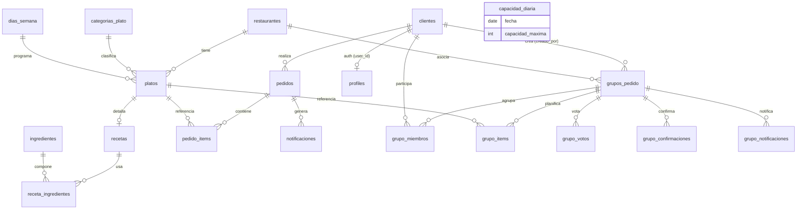

# 📖 Documentación Técnica – Base de Datos Hildegardiana

> Sistema de recetas y pedidos basado en la medicina de Santa Hildegarda de Bingen.
> Backend: **PostgreSQL (Supabase)** con uso de **JSONB** y arrays para campos flexibles.

> [!NOTE]
> Este documento se construyó a partir de:
> - El mapa de relaciones provisto por el equipo.
> - Los tipos TypeScript en [src/types/index.ts](../src/types/index.ts).
> - Las llamadas `.from(...)` y `.insert(...)` reales del código (API routes y `lib/`).
> - La migración [supabase/migrations/0001_auth_profiles.sql](../supabase/migrations/0001_auth_profiles.sql).
>
> Los **tipos exactos, `NOT NULL`, `DEFAULT` y reglas `ON DELETE/UPDATE`** deben
> confirmarse con la salida de las consultas a `information_schema`
> (ver [§7 Consultas de introspección](#7-consultas-de-introspección)).
> Las columnas marcadas con `≈` son inferidas del código y pendientes de verificación.

---

## 1. Resumen ejecutivo

| Métrica | Valor |
|---|---|
| Motor | PostgreSQL 15 (Supabase) |
| Tablas de negocio | ~19 detectadas en código (21 según diseño) |
| Ingredientes | ~398 (con perfil nutricional + hildegardiano completo) |
| Recetas | ~113 |
| Seguridad | Row Level Security (RLS) sobre `profiles`; resto vía `service_role` en API |
| Tipos especiales | `JSONB` (recetas, votos, tema), arrays (`text[]`, `uuid[]`) |

**Dominios principales**

- 🍽️ **Menú & recetas**: `restaurantes`, `categorias_plato`, `dias_semana`, `platos`, `recetas`, `receta_ingredientes`, `ingredientes`.
- 🛒 **Pedidos individuales**: `clientes`, `pedidos`, `pedido_items`.
- 👥 **Pedidos grupales**: `grupos_pedido`, `grupo_miembros`, `grupo_items` (+ `grupo_votos`, `grupo_confirmaciones`, `grupo_notificaciones` según diseño).
- 🔐 **Auth**: `profiles` (1‑a‑1 con `auth.users`).
- 📅 **Capacidad operativa**: `capacidad_diaria`.
- 🔔 **Notificaciones**: `notificaciones` (según diseño).

---

## 2. Diagrama Entidad‑Relación



**Mapa de relaciones (fuente: equipo)**

```text
clientes ←── pedidos ←── pedido_items ──→ platos
    │            │
    │            └──→ notificaciones
    │
    ├──→ grupos_pedido ←── grupo_miembros
    │              │
    │              ├──→ grupo_items ──→ platos
    │              ├──→ grupo_votos ──→ platos
    │              ├──→ grupo_confirmaciones
    │              └──→ grupo_notificaciones
    │
    └──→ profiles (auth)

platos ←── recetas ←── receta_ingredientes ──→ ingredientes
   │
   ├──→ categorias_plato
   ├──→ dias_semana
   └──→ restaurantes
```

---

## 3. Módulos funcionales

### 3.1 Menú & Recetas ⭐
Núcleo del sistema. Un `restaurante` publica `platos`, cada plato pertenece a una
`categoria_plato` y opcionalmente a un `dia_semana`. Cada plato puede tener una
`receta`, que se descompone en `receta_ingredientes` apuntando al catálogo maestro
`ingredientes` (con perfil nutricional y hildegardiano). El análisis nutricional y
hildegardiano se calcula **en tiempo real** en [src/lib/analisis-plato.ts](../src/lib/analisis-plato.ts)
y [src/lib/hildegarda.ts](../src/lib/hildegarda.ts).

### 3.2 Pedidos individuales
`clientes` → `pedidos` → `pedido_items` (cada ítem referencia un `plato`).
Lógica en [src/lib/pedidos.ts](../src/lib/pedidos.ts). Estados del pedido:
`pendiente_pago → confirmado → en_preparacion → listo → entregado` (o `cancelado`).

### 3.3 Pedidos grupales
Un cliente crea un `grupo_pedido` con una **palabra secreta** única; otros clientes
se unen como `grupo_miembros` (máx. 4). Los ítems planificados por fecha/comida se
guardan en `grupo_items` (con `votos` como array de clientes). Diseño contempla
`grupo_votos`, `grupo_confirmaciones` y `grupo_notificaciones`.
Rutas en [src/app/api/grupos/](../src/app/api/grupos/).

### 3.4 Autenticación & Roles
`profiles` (1‑a‑1 con `auth.users`). Roles: `admin` | `lector`. El **primer usuario**
registrado queda como `admin`. RLS activo; un trigger evita la auto‑promoción de rol.

### 3.5 Capacidad operativa
`capacidad_diaria` controla cupos por fecha (`capacidad_maxima`,
`pedidos_confirmados`, `pedidos_pendientes`). Ver
[src/lib/validaciones.ts](../src/lib/validaciones.ts).

### 3.6 Notificaciones (según diseño)
`notificaciones` y `grupo_notificaciones` — pendientes de confirmar en el esquema real.

---

## 4. Diccionario de datos

> `≈` = inferido del código, pendiente de verificar con `information_schema`.

### 4.1 `restaurantes`
| Columna | Tipo ≈ | Notas |
|---|---|---|
| id | uuid PK | |
| nombre | text | |
| slug | text | único, usado en `/menu/[slug]` |
| descripcion | text | |
| logo | text | URL |
| tagline | text | |
| tema | jsonb | colores/branding |
| horario_apertura | time/text | |
| horario_cierre | time/text | |
| telefono | text | |
| direccion | text | |
| instagram | text | |
| email | text | |

### 4.2 `categorias_plato`
| Columna | Tipo ≈ | Notas |
|---|---|---|
| id | int PK | |
| nombre | text | |
| descripcion | text | |
| icono | text | emoji |
| orden | int | orden de visualización |
| disponible_todos_dias | bool | |
| horario_inicio | time/text | |
| horario_fin | time/text | |

### 4.3 `dias_semana`
| Columna | Tipo ≈ | Notas |
|---|---|---|
| id | int PK | 1=lunes … 7=domingo |
| nombre | text | |

### 4.4 `platos`
| Columna | Tipo ≈ | Notas |
|---|---|---|
| id | uuid PK | |
| restaurante_id | uuid FK → restaurantes | |
| categoria_id | int FK → categorias_plato | |
| dia_semana_id | int FK → dias_semana | nullable |
| nombre | text | |
| descripcion | text | |
| precio | numeric | |
| imagen | text | URL |
| alergenos | text[] | |
| tags | text[] | |
| disponible | bool | |
| orden | int | |
| es_estrella | bool | |
| disponible_todos_dias | bool | |
| propiedades_hildegardianas | text | |

### 4.5 `recetas`
| Columna | Tipo ≈ | Notas |
|---|---|---|
| id | uuid PK | |
| plato_id | uuid FK → platos | |
| ingredientes | jsonb | `[{nombre, cantidad, unidad}]` (legacy/desnormalizado) |
| pasos | jsonb / text[] | |
| tiempo_min | int | |
| porciones | int | |
| dificultad | text | `fácil` \| `media` \| `difícil` |
| notas_hildegardianas | text | |

### 4.6 `receta_ingredientes`
| Columna | Tipo ≈ | Notas |
|---|---|---|
| id | uuid PK | |
| receta_id | uuid FK → recetas | |
| ingrediente_id | uuid FK → ingredientes | |
| cantidad | numeric | |
| unidad | text | |

### 4.7 `ingredientes` (catálogo maestro)
**Identidad y clasificación**
| Columna | Tipo ≈ | Notas |
|---|---|---|
| id | uuid PK | |
| nombre | text | |
| categoria | text | filtro de catálogo |
| activo | bool | soft‑delete |

**Perfil nutricional (por 100 g/ml)**
`calorias`, `proteinas_g`, `carbohidratos_g`, `grasas_g`, `grasas_saturadas_g`,
`fibra_g`, `azucar_g` — todos `numeric ≈`.

**Minerales (mg)**: `sodio_mg`, `calcio_mg`, `hierro_mg`, `magnesio_mg`,
`potasio_mg`, `zinc_mg`, `fosforo_mg`.

**Vitaminas**: `vitamina_a_mcg`, `vitamina_c_mg`, `vitamina_d_mcg`,
`vitamina_e_mg`, `vitamina_k_mcg`, `vitamina_b1_mg`, `vitamina_b2_mg`,
`vitamina_b3_mg`, `vitamina_b5_mg`, `vitamina_b6_mg`, `vitamina_b9_mcg`,
`vitamina_b12_mcg`.

**Atributos hildegardianos**
| Columna | Tipo ≈ | Notas |
|---|---|---|
| es_veneno_hildegardiano | bool | ingrediente "veneno" según Hildegarda |
| es_base_alegria | bool | uno de los pilares de alegría |
| nivel_subtilitat | int/text | *subtilitas* (sutileza) |
| requiere_coccion | bool | |
| temperamento | text | caliente/frío/seco/húmedo |
| propiedades_hildegardianas | text | |

### 4.8 `clientes`
| Columna | Tipo ≈ | Notas |
|---|---|---|
| id | uuid PK | |
| user_id | uuid FK → auth.users | nullable |
| nombre | text | |
| email | text | |
| telefono | text | |
| direccion | text | |
| barrio | text | |
| ciudad | text | |
| notas | text | |
| es_vip | bool | |
| total_pedidos | int | |

### 4.9 `pedidos`
| Columna | Tipo ≈ | Notas |
|---|---|---|
| id | uuid PK | |
| cliente_id | uuid FK → clientes | |
| restaurante_id | uuid FK → restaurantes | |
| fecha_inicio / fecha_fin | date | plan de días |
| fecha_entrega | date | |
| horario_entrega | text | |
| tipo_entrega | text | `domicilio` \| `retiro` |
| direccion_entrega | text | nullable |
| estado | text | ver §3.2 |
| subtotal / costo_envio / descuento / total | numeric | |
| metodo_pago | text | `transferencia` \| `mercadopago` \| `efectivo` |
| pago_confirmado | bool | |
| pago_referencia | text | |
| notas_cliente / notas_admin | text | |
| modificado_admin | bool | |
| fecha_modificacion | timestamptz | |
| motivo_modificacion | text | |
| created_at | timestamptz | default now() |

### 4.10 `pedido_items`
| Columna | Tipo ≈ | Notas |
|---|---|---|
| id | uuid PK | |
| pedido_id | uuid FK → pedidos | |
| plato_id | uuid FK → platos | |
| fecha | date | |
| tipo_comida | text | |
| cantidad | int | |
| precio_unitario | numeric | |
| subtotal | numeric | `cantidad × precio_unitario` |
| notas | text | |

### 4.11 `profiles` (✅ confirmado por migración)
| Columna | Tipo | Constraint |
|---|---|---|
| id | uuid | PK, FK → auth.users(id) ON DELETE CASCADE |
| email | text | |
| nombre | text | |
| telefono | text | (añadido en 0002) |
| rol | text | NOT NULL, DEFAULT `'lector'`, CHECK IN (`admin`,`lector`) |
| created_at | timestamptz | NOT NULL, DEFAULT now() |

### 4.12 `grupos_pedido`
| Columna | Tipo ≈ | Notas |
|---|---|---|
| id | uuid PK | |
| palabra_secreta | text | única, generada 6 chars alfanuméricos |
| restaurante_id | uuid FK → restaurantes | |
| creado_por | uuid FK → clientes | (`grupos_pedido_creado_por_fkey`) |
| fecha_inicio / fecha_fin | date | máx. 30 días, mín. 10 días de anticipación |
| estado | text | `armando`, … |
| created_at | timestamptz | |

### 4.13 `grupo_miembros`
| Columna | Tipo ≈ | Notas |
|---|---|---|
| id | uuid PK | |
| grupo_id | uuid FK → grupos_pedido | |
| cliente_id | uuid FK → clientes | |
| rol | text | `creador` \| `miembro` (máx. 4 por grupo) |
| confirmado_general | bool | default false |

### 4.14 `grupo_items`
| Columna | Tipo ≈ | Notas |
|---|---|---|
| id | uuid PK | |
| grupo_id | uuid FK → grupos_pedido | |
| fecha | date | |
| tipo_comida | text | |
| plato_id | uuid FK → platos | |
| cantidad | int | |
| seleccionado_por | uuid FK → clientes | |
| modificado_por | uuid FK → clientes | |
| votos | uuid[] / jsonb | array de cliente_id |
| — | — | **UNIQUE(grupo_id, fecha, tipo_comida)** |

### 4.15 `capacidad_diaria`
| Columna | Tipo ≈ | Notas |
|---|---|---|
| id | uuid PK | |
| fecha | date | única |
| capacidad_maxima | int | default 50 |
| pedidos_confirmados | int | |
| pedidos_pendientes | int | |

### 4.16 Tablas del diseño pendientes de confirmar
`notificaciones`, `grupo_votos`, `grupo_confirmaciones`, `grupo_notificaciones`.
No aparecen en el código actual; confirmar con las consultas de introspección.

---

## 5. Mapa de relaciones (Foreign Keys)

| Tabla | Columna | Referencia | ON DELETE ≈ | ON UPDATE ≈ |
|---|---|---|---|---|
| profiles | id | auth.users(id) | **CASCADE** ✅ | NO ACTION |
| platos | restaurante_id | restaurantes(id) | RESTRICT | NO ACTION |
| platos | categoria_id | categorias_plato(id) | RESTRICT | NO ACTION |
| platos | dia_semana_id | dias_semana(id) | SET NULL | NO ACTION |
| recetas | plato_id | platos(id) | CASCADE | NO ACTION |
| receta_ingredientes | receta_id | recetas(id) | CASCADE | NO ACTION |
| receta_ingredientes | ingrediente_id | ingredientes(id) | RESTRICT | NO ACTION |
| clientes | user_id | auth.users(id) | SET NULL | NO ACTION |
| pedidos | cliente_id | clientes(id) | RESTRICT | NO ACTION |
| pedidos | restaurante_id | restaurantes(id) | RESTRICT | NO ACTION |
| pedido_items | pedido_id | pedidos(id) | CASCADE | NO ACTION |
| pedido_items | plato_id | platos(id) | RESTRICT | NO ACTION |
| grupos_pedido | creado_por | clientes(id) | RESTRICT | NO ACTION |
| grupos_pedido | restaurante_id | restaurantes(id) | RESTRICT | NO ACTION |
| grupo_miembros | grupo_id | grupos_pedido(id) | CASCADE | NO ACTION |
| grupo_miembros | cliente_id | clientes(id) | CASCADE | NO ACTION |
| grupo_items | grupo_id | grupos_pedido(id) | CASCADE | NO ACTION |
| grupo_items | plato_id | platos(id) | RESTRICT | NO ACTION |

> Solo `profiles.id → auth.users` está **confirmado** por migración. El resto de las
> reglas `ON DELETE/UPDATE` son propuestas coherentes con el uso; **verificar** con §7.

---

## 6. Índices y performance

**Índices confirmados / implícitos**
- PK de cada tabla (índice B‑tree automático).
- `profiles.id` (PK + FK a `auth.users`).

**Índices recomendados** (según patrones de consulta del código)

| Índice sugerido | Motivo (consulta en código) |
|---|---|
| `platos(restaurante_id, categoria_id, orden)` | Listado de menú por restaurante ordenado |
| `platos(disponible)` | Filtro `.eq('disponible', true)` |
| `recetas(plato_id)` | Join receta ↔ plato |
| `receta_ingredientes(receta_id)` | Agrupar ingredientes por receta (`.in('receta_id', …)`) |
| `receta_ingredientes(ingrediente_id)` | Reverse lookup / lista de compras |
| `ingredientes(activo, nombre)` | Catálogo filtrado y ordenado |
| `ingredientes(categoria)` | Filtro por categoría |
| `pedidos(cliente_id, created_at DESC)` | Historial del cliente |
| `pedido_items(pedido_id)` | Ítems de un pedido |
| `grupos_pedido(estado, created_at DESC)` | Listado de grupos "armando" |
| `UNIQUE grupos_pedido(palabra_secreta)` | Búsqueda por palabra secreta / unicidad |
| `grupo_miembros(grupo_id)` | Conteo/listado de miembros |
| `UNIQUE grupo_items(grupo_id, fecha, tipo_comida)` | Upsert `onConflict` en selección grupal |
| `UNIQUE capacidad_diaria(fecha)` | Búsqueda de cupo por fecha |

**Recomendaciones adicionales**
- Considerar `GIN` sobre `platos.tags` / `platos.alergenos` si se filtra por arrays.
- Evaluar mover los ingredientes desnormalizados de `recetas.ingredientes` (JSONB)
  hacia `receta_ingredientes` para evitar duplicación de la fuente de verdad.

---

## 7. Consultas de introspección

Ejecutar en el **SQL Editor de Supabase** y pegar la salida para completar/verificar
los tipos exactos, FKs e índices de este documento.

**7.1 Columnas de todas las tablas**
```sql
SELECT table_name, column_name, data_type, is_nullable, column_default
FROM information_schema.columns
WHERE table_schema = 'public'
ORDER BY table_name, ordinal_position;
```

**7.2 Foreign keys con reglas ON UPDATE/DELETE**
```sql
SELECT tc.table_name, tc.constraint_name, kcu.column_name,
       ccu.table_name AS foreign_table_name, ccu.column_name AS foreign_column_name,
       rc.update_rule, rc.delete_rule
FROM information_schema.table_constraints tc
LEFT JOIN information_schema.key_column_usage kcu
  ON tc.constraint_name = kcu.constraint_name AND tc.table_schema = kcu.table_schema
LEFT JOIN information_schema.constraint_column_usage ccu
  ON ccu.constraint_name = tc.constraint_name AND ccu.table_schema = tc.table_schema
LEFT JOIN information_schema.referential_constraints rc
  ON tc.constraint_name = rc.constraint_name AND tc.table_schema = rc.constraint_schema
WHERE tc.table_schema = 'public' AND tc.constraint_type = 'FOREIGN KEY'
ORDER BY tc.table_name, kcu.column_name;
```

**7.3 Conteo de columnas por tabla**
```sql
SELECT table_name,
  (SELECT COUNT(*) FROM information_schema.columns c
   WHERE c.table_name = t.table_name AND c.table_schema = 'public') AS columnas
FROM information_schema.tables t
WHERE table_schema = 'public' AND table_type = 'BASE TABLE'
ORDER BY table_name;
```

**7.4 Índices existentes**
```sql
SELECT tablename, indexname, indexdef
FROM pg_indexes
WHERE schemaname = 'public'
ORDER BY tablename, indexname;
```
